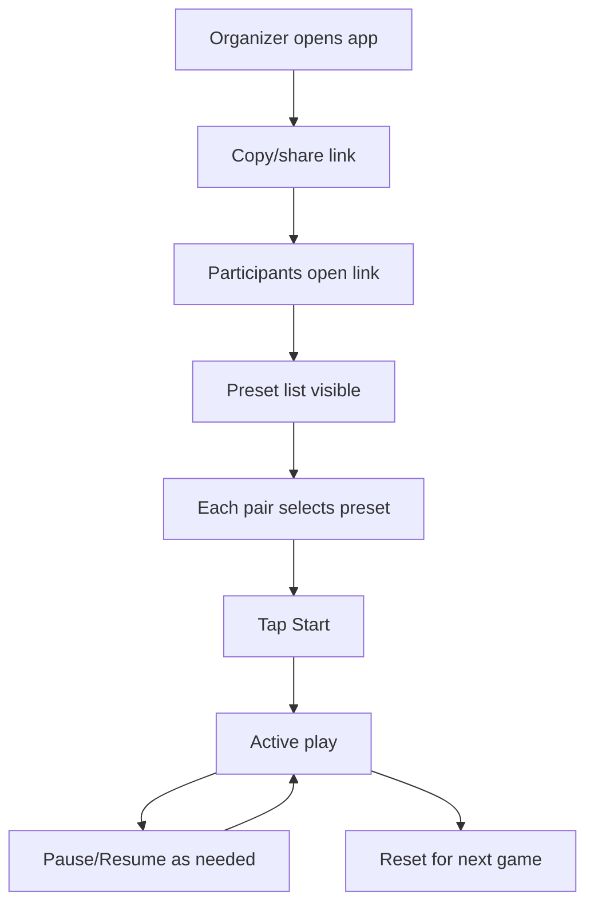
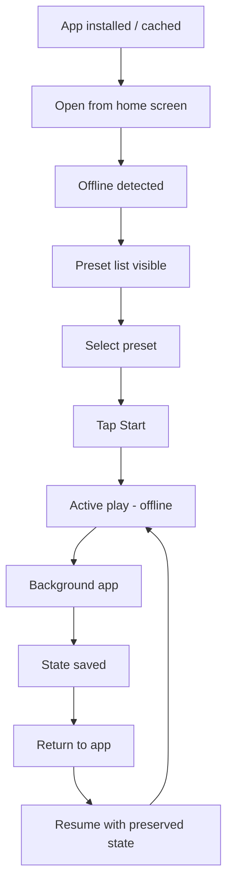

# UX Design Specification chess-timer

**Author:** Ricky
**Date:** 2026-02-02

---

<!-- UX design content will be appended sequentially through collaborative workflow steps -->

## Executive Summary

### Project Vision

chess-timer is a mobile-first, installable PWA chess timer designed for instant, offline-ready play with a clean, Teenage Engineering-inspired aesthetic. The experience prioritizes speed to first game, accuracy in turn switching, and a distraction-free interface that stays out of the way. The MVP defaults to an adaptive 80/20 hit-surface layout to reduce mis-taps and increase confidence, with a Classic 50/50 layout available via settings.

### Target Users

- Casual pairs at home who want to start a game quickly without downloading an app.
- Club organizers/teachers who need fast, reliable timers across multiple boards.
- Tournament travelers who need dependable offline operation and accurate timing.
- Tech-savvy hobbyists who prefer minimalist, purpose-built tools over bloated apps.

### Key Design Challenges

- Make the adaptive 80/20 layout instantly understandable and safe under fast play.
- Provide essential controls (pause, reset, undo, settings) without cluttering the play surface.
- Maintain trust in timing accuracy and state persistence across interruptions and orientation changes.

### Design Opportunities

- Use a lightweight onboarding cue to explain adaptive layout and pause gesture.
- Establish a calm, tool-like visual language with strong typographic hierarchy and minimal chrome.
- Offer frictionless settings access that preserves active game state and reinforces reliability.

## Core User Experience

### Defining Experience

The core experience is fast, confident turn switching during live play. Users should be able to select a time control and start a game in under 60 seconds, then play uninterrupted with large, unambiguous tap zones. The MVP defaults to an adaptive 80/20 hit-surface layout that prioritizes active-player accuracy, with a Classic 50/50 layout available via settings. Recovery actions (pause, undo, reset) are always close at hand and never interrupt state.

### Platform Strategy

- Platform: mobile-first web PWA with installability and offline-first behavior after first load.
- Primary input: touch; mouse/keyboard supported but secondary.
- Device context: phones placed on a table between players, in portrait and landscape with safe-area support.
- Offline required: all gameplay flows (start, switch, pause, undo, reset, settings) must work without network.
- Device capabilities: leverage Wake Lock where available, with a non-blocking fallback if unsupported.
- Defaults: sound ON and vibration ON on first launch, with fast toggles in settings.

### Effortless Interactions

- Start a game from a preset in seconds without navigation friction.
- Switch turns with a single tap and immediate visual/haptic feedback.
- Pause/resume and undo without losing context or time.
- Open settings without leaving active play; changes take effect instantly.
- Reopen the app and resume or restart with last-used control automatically.

### Critical Success Moments

- First-time user starts a game within 60 seconds and immediately understands tap-to-switch.
- First turn switch feels precise and reliable with no delay or mis-tap.
- First pause/undo works instantly and restores trust after an error.
- Offline re-open launches quickly and allows immediate play without errors.

### Experience Principles

- Speed to first game beats configuration depth.
- Switching must feel deliberate, accurate, and low-risk.
- Minimal chrome: only the essentials during active play.
- Reliability over cleverness: preserve state and timing above all.
- Accessibility by default: clear hierarchy, large digits, high contrast, and large targets.

## Desired Emotional Response

### Primary Emotional Goals

Users should feel calm, in control, and confident during play. The product should feel like a precise tool: reliable, minimal, and trustworthy.

### Emotional Journey Mapping

- Discovery: curious and intrigued by a clean, modern timer that feels purpose-built.
- First start: relief and confidence from a fast, obvious setup flow.
- Active play: focused and in control, with quiet assurance that timing is accurate.
- Recovery (pause/undo): reassured and unflustered; mistakes feel easy to fix.
- Return use: familiarity and trust; “this just works.”

### Micro-Emotions

- Confidence over confusion in the adaptive 80/20 layout.
- Trust over skepticism in timing accuracy and state persistence.
- Calm over anxiety during active play and interruptions.
- Satisfaction over frustration when undo/pause/reset are used.

### Design Implications

- Calm/Control → minimal visual noise, strong hierarchy, large targets, and stable layout.
- Trust → immediate feedback on tap, visible active side, and clear paused/ended states.
- Confidence → lightweight onboarding cue for adaptive layout; consistent motion and haptics.
- Reassurance → undo/pause affordances always visible and fast.

### Emotional Design Principles

- Feel like a tool, not a toy.
- Reduce cognitive load during active play.
- Make recovery effortless and non-judgmental.
- Prioritize clarity and stability over novelty.

## UX Pattern Analysis & Inspiration

### Inspiring Products Analysis

**Apple Fitness (iOS)**
- Strengths: clean, simple, easy to understand; glanceable status and strong typographic hierarchy.
- UX takeaways: bold typography, generous spacing, clear state cues, and calm tone.

**Flighty**
- Strengths: clean, simple, easy to understand; dense info without clutter.
- UX takeaways: prioritize primary info, reduce chrome, and make status obvious at a glance.

### Transferable UX Patterns

- Glanceable status with clear active/paused/ended states.
- Strong typographic hierarchy: large, legible primary information (timer digits).
- Minimal navigation and limited controls during the core task.
- Single accent color to reinforce active side and state changes.

### Anti-Patterns to Avoid

- Overloaded screens with secondary controls competing for attention.
- Decorative or gimmicky effects that reduce clarity during play.
- Skeuomorphic chessboard/clock styling that adds noise.
- Small tap targets or ambiguous active-side indicators.

### Design Inspiration Strategy

**What to Adopt:**
- Clean, minimal layouts with strong hierarchy and clear state cues.
- Fast access to the primary action with minimal UI chrome.

**What to Adapt:**
- Fitness/Flighty’s glanceable status patterns to a two-player timer view.
- Subtle feedback patterns (highlight, haptics) for tap confirmation.

**What to Avoid:**
- Feature-heavy dashboards or multi-layer navigation that delay play.
- Visual noise or busy iconography that competes with the timer.

## Design System Foundation

### 1.1 Design System Choice

Use shadcn/ui as the base component system (Vite install) with a custom theme layer to establish a new, clean, modern, tool-like brand aesthetic inspired by Teenage Engineering and Braun.

### Rationale for Selection

- Provides solid, accessible base components while allowing strong visual differentiation.
- Supports rapid iteration for MVP while keeping the UI minimal and consistent.
- Aligns with the need for precise, tool-like interaction patterns and typography.

### Implementation Approach

- Install shadcn/ui in the Vite app and use it for foundational components (buttons, toggles, sheets/drawers, dialogs, form controls).
- Extend with custom components where needed (timer surfaces, active/inactive states, pause/undo controls).
- Keep the component set intentionally small to reduce visual noise and ensure consistency.

### Customization Strategy

- Define a new brand system with restrained color, strong typography hierarchy, and minimal ornamentation.
- Use a neutral base palette with a single accent for active side states.
- Apply consistent spacing, radius, and motion tokens to create a calm, precise feel.

## Visual Design Foundation

### Color System

- **Base palette:** neutral, matte foundation (soft off-white, warm gray, charcoal) to keep the interface calm and tool-like.
- **Accent:** `#EC7B43` for active side state, primary actions, and key feedback.
- **State colors:** keep success/warn/error muted and secondary to the core timer state.
- **Contrast:** maintain WCAG AA for all text and timer digits; active state contrast must remain clear in bright environments.

### Typography System

- **Tone:** modern, precise, minimal; strong hierarchy with large numerals.
- **Primary type:** a clean, geometric sans for UI labels and settings.
- **Display type:** a legible, industrial-inspired numeral style for timers (tabular figures preferred).
- **Scale:** oversized timer digits, compact labels; avoid excessive text.
- **Readability:** high contrast, generous letter spacing for large numerals; tight leading for labels.

### Spacing & Layout Foundation

- **Density:** minimal UI chrome with generous negative space to reinforce calm focus.
- **Spacing unit:** 8px base grid; multiples for layout rhythm.
- **Layout:** single-column on mobile; timer zones dominate vertical space; controls grouped and consistent.
- **Safe areas:** respect notch/safe-area insets in both portrait and landscape.

### Elevation & Surface Treatment

- **Surfaces:** mostly flat; subtle layering for settings and modal states only.
- **Elevation:** minimal shadow or tonal separation to avoid visual noise.
- **States:** active side uses color and slight emphasis, not heavy depth.

### Motion & Feedback

- **Motion:** restrained, functional transitions (state change, pause/resume, settings open).
- **Timing:** quick, responsive easing to reinforce precision.
- **Feedback:** haptics and optional sound for turn switch/pause; visual changes are immediate and clear.
- **Reduced motion:** non-essential animations disabled when reduced-motion is set.

## Design Direction Decision

### Design Directions Explored

- Direction A: Soft Matte - warm, neutral surfaces with minimal chrome.
- Direction B: Clean Band - layered bands and clear hierarchy for controls.
- Direction C: Gridline - structured layout with crisp separation and precision.
- Direction D: Dark Accent - dark active surface for strong focus.
- Direction E: Accent Halo - soft accent emphasis with airy spacing.
- Direction F: Utility Split - compact controls and prominent split zones.

### Chosen Direction

Direction B: Clean Band, with player A timer digits rotated 180 degrees for opposite-seating readability while all controls remain upright.

### Design Rationale

- Clean band hierarchy keeps controls legible without competing with the timer.
- Rotation improves readability for the opposing player without adding visual noise.
- Matches the calm, tool-like aesthetic while preserving quick scanning.

### Implementation Approach

- Use Direction B as the baseline layout from the HTML showcase and `docs/option-B.png`.
- Keep controls upright; rotate only the player A timer digits.
- Apply the neutral base palette with accent `#EC7B43` and large, tabular digits.

## User Journey Flows

### Casual Duo (Success Path + Accidental Tap Recovery)

**Goal:** Start quickly, switch turns confidently, recover from mistakes without losing trust.

```mermaid
flowchart TD
  A[Open app link] --> B[Preset list visible]
  B --> C[Select preset]
  C --> D[Tap Start]
  D --> E[Timer view - adaptive 80/20]
  E --> F[Tap active zone to switch turns]
  F --> E
  E --> G[Accidental tap occurs]
  G --> H[Tap Undo]
  H --> E
  E --> I[Pause via inactive strip]
  I --> J[Paused 50/50 view]
  J --> E
  E --> K[Game ends (time zero)]
```

### Club Organizer (Multi-Board Setup)

**Goal:** Share quickly, enable fast setup on multiple devices with minimal friction.



### Tournament Traveler (Offline Reliability)

**Goal:** Start instantly offline, maintain accuracy, recover state after backgrounding.



### Journey Patterns

- Fast start from preset list with no intermediate screens.
- Single-tap turn switch with immediate feedback.
- Recovery actions (pause/undo/reset) always available and non-destructive.
- Offline-first flows mirror online behavior.

### Flow Optimization Principles

- Minimize steps to “game running.”
- Keep decision points binary and visible (preset > start).
- Favor persistent controls over hidden menus during play.
- Treat error recovery as a first-class, single-tap action.

## Component Strategy

### Design System Components

Use shadcn/ui for standard UI building blocks:
- Buttons, toggles, switches, sliders
- Tabs/segmented control, select/dropdown
- Sheet/drawer (settings), dialog (confirm reset), tooltip
- Form inputs (custom control inputs), labels, and helper text
- Toasts for lightweight notifications (e.g., offline status)

### Custom Components

### Timer Surface
**Purpose:** Core interaction surface for turn switching and state display.  
**Usage:** Primary in-game view.  
**Anatomy:** Active zone, inactive strip (pause affordance), timer digits, active state indicator.  
**States:** idle, running (active side highlighted), paused (50/50), ended (zero time).  
**Variants:** Adaptive 80/20, Classic 50/50.  
**Accessibility:** Clear focus ring for keyboard; ARIA labels for active side; non-color state cues.  
**Content Guidelines:** Large, tabular digits; minimal labels.  
**Interaction Behavior:** Single-tap on active zone switches turns; inactive strip pauses.

### Control Band
**Purpose:** Compact, persistent controls (undo, pause/resume, reset).  
**Usage:** Always visible during play; separate band from timer surface.  
**Anatomy:** Icon + label buttons, grouped by priority.  
**States:** enabled, disabled (no active game), active (pause/resume).  
**Variants:** Compact (in-game), expanded (setup).  
**Accessibility:** 44px min target; keyboard navigable; clear labels.

### Preset Selector
**Purpose:** Fast preset selection at launch.  
**Usage:** Setup screen before start.  
**Anatomy:** Preset chips, custom entry link, last-used indicator.  
**States:** default, selected, disabled (during active game).  
**Variants:** compact vs. expanded list.  
**Accessibility:** Visible focus and clear selection state.

### Status Strip
**Purpose:** Surface for game state messaging (paused, offline, wake lock unavailable).  
**Usage:** Inline banner at top or between surfaces.  
**States:** info, warning, error.  
**Accessibility:** Role=“status” for non-blocking updates.

### Component Implementation Strategy

- Start with shadcn/ui components as the baseline; wrap only when customization is needed.
- Build custom components using shared tokens (spacing, typography, color, motion).
- Keep component APIs minimal to reduce complexity and maintenance overhead.
- Ensure all states are designed and tested in both adaptive and classic layouts.

### Implementation Roadmap

**Phase 1 - Core Components:**
- Timer Surface
- Control Band
- Preset Selector

**Phase 2 - Supporting Components:**
- Settings Drawer (shadcn/ui Sheet)
- Custom Control Form
- Status Strip

**Phase 3 - Enhancements:**
- Install prompt hints
- Onboarding cue for adaptive layout

## UX Consistency Patterns

### Button Hierarchy

**When to Use:** Primary for Start/Resume, secondary for Pause/Undo/Reset, tertiary for settings and informational actions.  
**Visual Design:** Primary uses accent `#EC7B43`; secondary uses neutral fill; tertiary uses minimal outline/text.  
**Behavior:** Immediate feedback on press; disabled when no active game.  
**Accessibility:** 44px min target, visible focus ring, labels always visible.  
**Mobile Considerations:** Prioritize thumb reach, keep primary action in the control band.

### Feedback Patterns

**When to Use:** Turn switch, pause/resume, undo/reset, offline status, wake lock unavailable.  
**Visual Design:** Clear active-state highlight, subtle banner for status, minimal iconography.  
**Behavior:** Instant visual change; optional haptic + sound when enabled.  
**Accessibility:** Non-color cues for state changes; banner role=“status”.

### Form Patterns

**When to Use:** Custom control creation (base, increment, delay).  
**Visual Design:** Inline labels, large numeric inputs, helper text beneath.  
**Behavior:** Real-time validation; disable Start until valid.  
**Accessibility:** Input labels tied to fields; error text announced.

### Navigation Patterns

**When to Use:** Settings access, back to setup, game reset confirmation.  
**Visual Design:** Settings in a bottom sheet; minimal header.  
**Behavior:** Settings never discard game state; confirmation dialog only for destructive actions.  
**Accessibility:** Focus trapped in sheet/dialog; escape closes.

### Additional Patterns

**Loading/Empty:** App opens instantly; if data missing, default to last-used or first preset.  
**Errors:** Non-blocking message for wake lock or offline; no modal unless destructive.  
**State Banners:** Single-line status strip for paused/offline/wake lock warnings.

## Responsive Design & Accessibility

### Responsive Strategy

- **Mobile-first:** phones on a table are the primary use case; the timer surface dominates the viewport.
- **Tablet:** maintain the same hierarchy with increased spacing; keep controls within easy reach.
- **Desktop:** preserve the single-column focus; avoid multi-panel complexity; allow larger digits and clearer spacing.

### Breakpoint Strategy

- Use standard breakpoints with mobile-first rules:
  - 320–767px: mobile
  - 768–1023px: tablet
  - 1024px+: desktop
- Prioritize continuity of the timer surface and control band across all sizes.

### Accessibility Strategy

- Target WCAG 2.1 AA.
- Contrast >= 4.5:1 for timer digits and active states.
- Touch targets >= 44x44px for all actions.
- Keyboard navigation supported for all controls and settings.
- Reduced motion honored; non-essential animations disabled.

### Testing Strategy

- Mobile Safari + Android Chrome for primary workflows.
- Desktop Chrome/Safari/Firefox for secondary coverage.
- VoiceOver + keyboard-only flow on core screens.
- Contrast checking for active/inactive states.

### Implementation Guidelines

- Use rem-based typography with tabular numerals for timers.
- Respect safe-area insets for notches and home indicators.
- Ensure active state is conveyed by more than color alone.
- Persist game state across orientation changes and backgrounding.

## Design Direction Decision

### Design Directions Explored

- Direction A: Soft Matte - warm, neutral surfaces with minimal chrome.
- Direction B: Clean Band - layered bands and clear hierarchy for controls.
- Direction C: Gridline - structured layout with crisp separation and precision.
- Direction D: Dark Accent - dark active surface for strong focus.
- Direction E: Accent Halo - soft accent emphasis with airy spacing.
- Direction F: Utility Split - compact controls and prominent split zones.

### Chosen Direction

- Direction B: Clean Band, with player A's timer digits rotated 180 degrees for opposite seating readability.

### Key Adjustments

- Rotate one player's timer digits 180 degrees; keep controls upright and readable.
- Maintain the adaptive 80/20 layout while preserving clear active-side emphasis.

### Design Rationale

- Clean Band provides the most legible hierarchy for the adaptive 80/20 layout.
- The rotated timer preserves in-person usability when phones sit between players.
- The banded structure supports quick glanceability without visual noise.

### Implementation Approach

- Apply Direction B as the baseline for in-game layout and timer surfaces.
- Keep the neutral base palette with accent `#EC7B43` for active state emphasis.
- Use large, tabular timer digits and restrained motion consistent with the visual foundation.
- Reference mockup: `docs/option-B.png` and the direction set in `_bmad-output/planning-artifacts/ux-design-directions.html`.

## 2. Core User Experience

### 2.1 Defining Experience

The defining experience is instant, precise, single-tap turn switching using the adaptive 80/20 layout. The active player’s area dominates the surface for accuracy and speed, while the inactive strip enables a calm, no-fuss pause interaction. The app should feel tool-like: fast to start, precise during play, and invisible when it’s working.

### 2.2 User Mental Model

Users expect a chess clock to be as simple as a physical timer: tap to switch, see whose turn it is, and trust the time. They bring the mental model of two sides with a clear active state, large digits, and immediate feedback. The adaptive 80/20 layout is a variation on the classic 50/50 split, so it must still feel obvious, safe, and predictable with minimal learning.

### 2.3 Success Criteria

- Turn switching feels instant, precise, and consistent with immediate visual and haptic feedback.
- Users understand the 80/20 layout and can pause from the inactive strip without confusion.
- Active state is unmistakable at a glance; no ambiguity about whose clock is running.
- The core loop (tap-to-switch) works flawlessly under fast, repeated use.

### 2.4 Novel UX Patterns

- **Novel element:** adaptive 80/20 hit-surface prioritizes the active player’s tap area.
- **Familiar elements:** two-timer model, tap-to-switch interaction, visible active state.
- **Education approach:** lightweight onboarding cue and persistent visual affordances to reinforce the inactive strip’s pause capability.

### 2.5 Experience Mechanics

**1. Initiation**
- Users select a preset and tap Start; the timer view opens with the active side clearly indicated.

**2. Interaction**
- Users tap the active 80% zone to switch turns; the tap target is large and unambiguous.
- The inactive 20% strip acts as a secondary control for pausing during play.

**3. Feedback**
- Immediate visual state change (active side highlight and timer motion).
- Haptic and optional sound confirmation on switch and pause.
- Clear paused state that expands to 50/50 for readability.

**4. Completion**
- Users see time run to zero for one side with a clear end state.
- Reset returns to the initial control without leaving the timer view.
