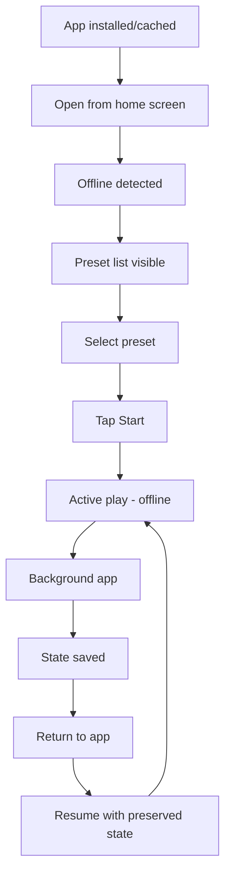

# Tournament Traveler Flow (Offline Reliability)

Goal: Start instantly offline, maintain accuracy, and recover state after backgrounding.

```mermaid
flowchart TD
  A[App installed/cached] --> B[Open from home screen]
  B --> C[Offline detected]
  C --> D[Preset list visible]
  D --> E[Select preset]
  E --> F[Tap Start]
  F --> G[Active play - offline]
  G --> H[Background app]
  H --> I[State saved]
  I --> J[Return to app]
  J --> K[Resume with preserved state]
  K --> G
```
